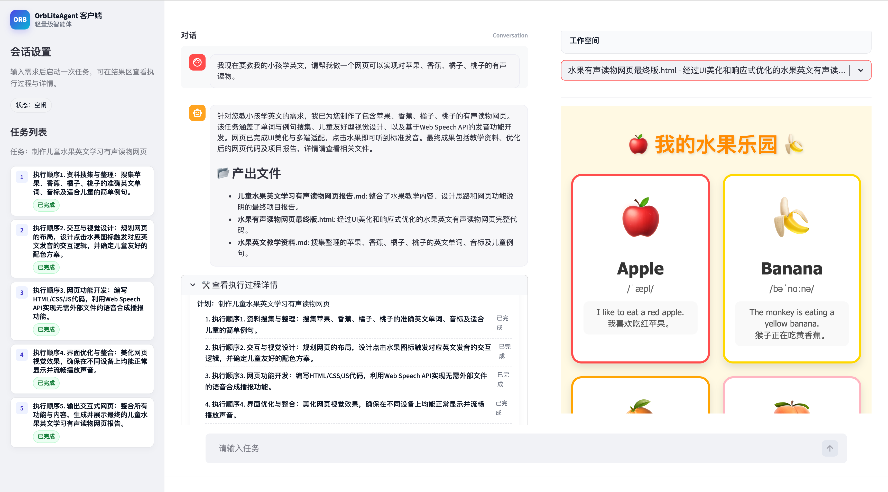

# OrbLiteAgent

一个以 Streamlit 构建的轻量级智能体应用，支持通过可视化界面进行交互与任务编排，面向快速实验与原型验证。

## 功能特性

- 交互式对话与任务执行
- 可配置的模型与工具接入
- 运行日志与结果展示
- 适合快速迭代的 Streamlit 界面

## 界面预览

以下为应用界面截图：




## 快速开始

### 环境要求

- Python 3.10+

### 安装依赖

推荐使用 `uv` 安装依赖：

```bash
uv sync
```

或使用 `pip` 安装：

```bash
pip install -e .
```

### 运行应用

```bash
streamlit run streamlit_app.py
```

启动后在浏览器访问终端提示的地址即可。

## 配置说明

- `config/config.toml`：应用配置
- `config/mcp.json`：MCP 相关配置

## 目录结构

```
.
├── config/           # 配置文件
├── docs/             # 文档与截图
├── orblite/          # 核心代码
├── streamlit_app.py  # Streamlit 入口
├── stepup.py         # 启动/辅助脚本
├── pyproject.toml    # 项目依赖与配置
└── uv.lock           # 依赖锁定文件
```

## 许可证

如需添加许可证信息，请在此处补充。
